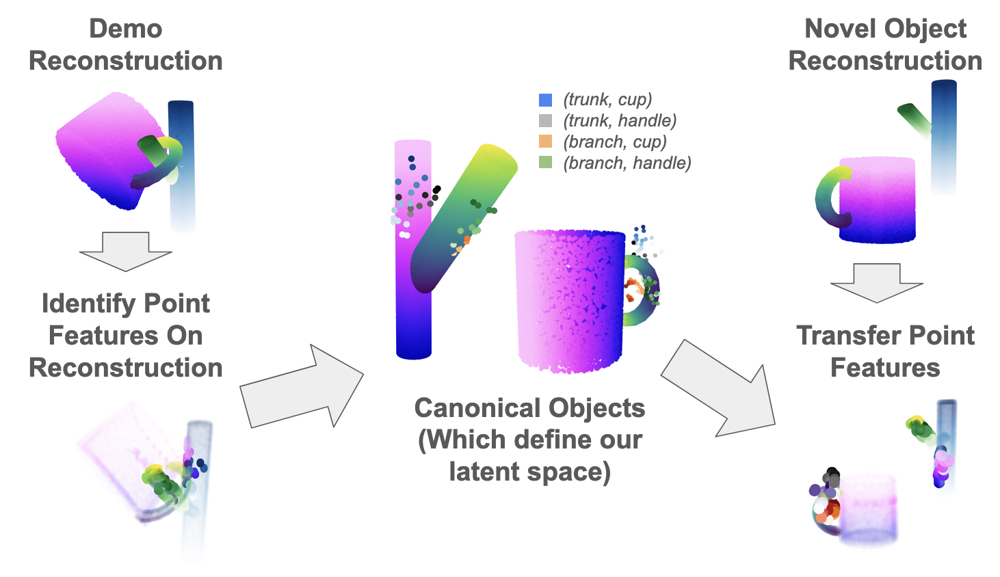
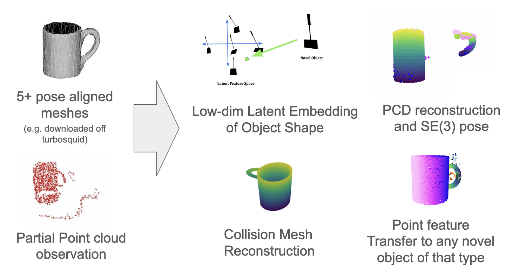

shape_warping
=============

Code by Ondrej Biza and Skye Thompson

Tested in python 3.9

This repository contains code for transferring features across objects of different geometry using shape warping, a technique introduced in **Rodriguez and Behnke** [^1] and extended in **Biza et al** [^2] and **Thompson et al** [^3]. It also includes tools for transferring object manipulation skills using those features via Interaction Warping [^2][^3].

Here you'll find the code for:

- Learning generative shape-warping models for objects or object parts. 
- Using those models to estimate the pose and shape of an object or part from a point cloud observation. 
- Transferring a manpulation skill from a demonstration to objects of the same category using shape-warping. 
- Recreating the simulation experiments in [^2][^3] [Coming soon!]

To install:

    git clone

    cd shape_warping

    pip install -e . 

Some pretrained warping models and meshes are included in data for running the example scripts. 

Example Scripts include:
 - *train_warp_model.py*: Trains a shape warping model from a set of pose-aligned meshes representing objects from a category 
 - *train_warp_model_parts.py*: Same as training a warp model, but in a loop over a set of presegmented parts 
 - *shape_reconstruction_example.py*: Given a shape warping model of a category, reconstruct the mesh and point cloud of an object from that category in an arbitrary pose from a partial point cloud.
 - *shape_reconstruction_by_parts.py*: Given a shape warping model of a set of part categories, reconstruct the mesh and point cloud of an object from that category in an arbitrary pose from presegmented partial point clouds of each part.
 - *shape_generation_visualizer.py*: Given one or multiple shape models, enables interactively exploring the latent space by varying individual PCA components. launched via Dash at localhost:8050.
 - *interaction_warping.py*: Transfers a manipulation skill from demonstration to novel objects from the same category with Interaction Warping. 

Future TODOs: 
     - Improve part example with cost function flags, mesh cleanup
     - Transferring simulation experiments
     - Add shape regularization cost option
     - Incorporate code for non-PCA warping model
     - Add warp/cost comparison example

[^1]: D. Rodriguez and S. Behnke, ["Transferring Category-Based Functional Grasping Skills by Latent Space Non-Rigid Registration,"](https://www.ais.uni-bonn.de/papers/RA-L_2018_Rodriguez.pdf) in IEEE Robotics and Automation Letters, vol. 3, no. 3, pp. 2662-2669, July 2018, doi: 10.1109/LRA.2018.2826057

[^2]: Biza, O., Thompson, S., Pagidi, K. R., Kumar, A., van der Pol, E., Walters, R., ... & Platt, R. (2023). [One-shot imitation learning via interaction warping.](https://arxiv.org/html/2306.12392v1)

[^3]: Thompson, S., Biza, O., Konidaris, G. (2025). One-Shot Cross-Geometry Skill Transfer through Part Decomposition, Preprint

Note
====

This project has been set up using PyScaffold 4.5. For details and usage
information on PyScaffold see https://pyscaffold.org/.
